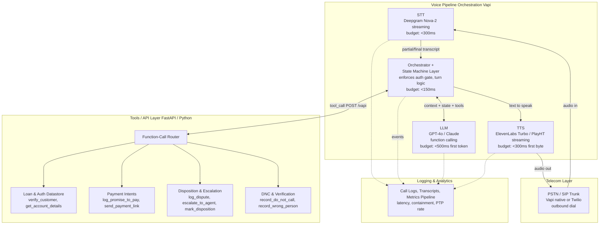

# Architecture Diagram

```mermaid
graph TD
    %% Nodes
    
    subgraph Vapi [Voice Pipeline Orchestration Vapi]
        STT[STT<br/>Deepgram Nova-2 streaming<br/>budget: <300ms]
        Orch[Orchestrator +<br/>State Machine Layer<br/>enforces auth gate, turn logic<br/>budget: <150ms]
        LLM[LLM<br/>GPT-4o / Claude<br/>function calling<br/>budget: <500ms first token]
        TTS[TTS<br/>ElevenLabs Turbo / PlayHT streaming<br/>budget: <300ms first byte]
    end
    
    subgraph Telecom [Telecom Layer]
        PSTN[PSTN / SIP Trunk<br/>Vapi native or Twilio<br/>outbound dial]
    end
    
    subgraph Observability [Logging & Analytics]
        Obs[Call Logs, Transcripts, Metrics Pipeline<br/>latency, containment, PTP rate]
    end
    
    subgraph FastAPI [Tools / API Layer FastAPI / Python]
        Router[Function-Call Router]
        DB[Loan & Auth Datastore<br/>verify_customer, get_account_details]
        PTP[Payment Intents<br/>log_promise_to_pay, send_payment_link]
        Disp[Disposition & Escalation<br/>log_dispute, escalate_to_agent, mark_disposition]
        DNC[DNC & Verification<br/>record_do_not_call, record_wrong_person]
    end
    
    %% Connections
    PSTN -->|audio in| STT
    TTS -->|audio out| PSTN
    STT -->|partial/final transcript| Orch
    Orch <-->|context + state + tools| LLM
    Orch -->|text to speak| TTS
    
    Orch <-->|tool_call POST /vapi| Router
    
    Router --> DB
    Router --> PTP
    Router --> Disp
    Router --> DNC
    
    STT -.-> Obs
    Orch -.->|events| Obs
    LLM -.-> Obs
    TTS -.-> Obs
```
