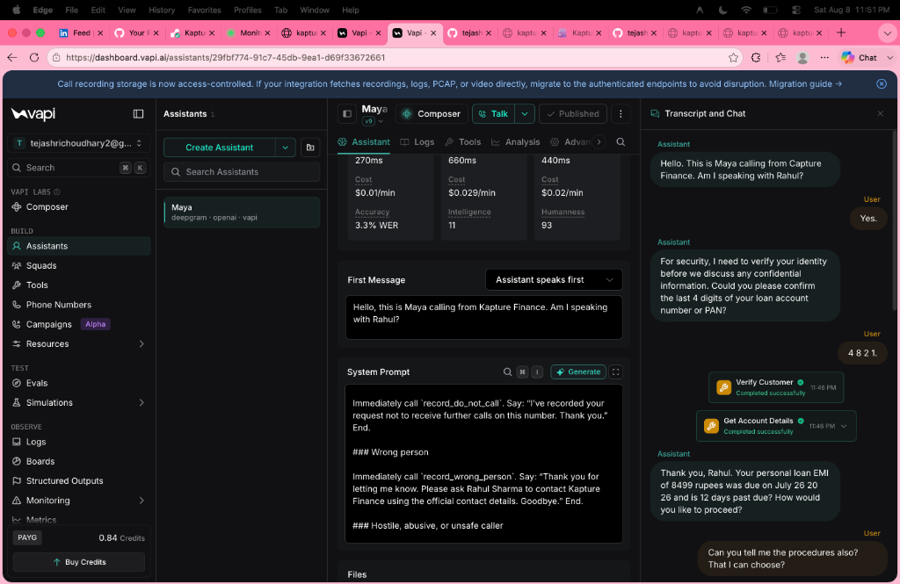
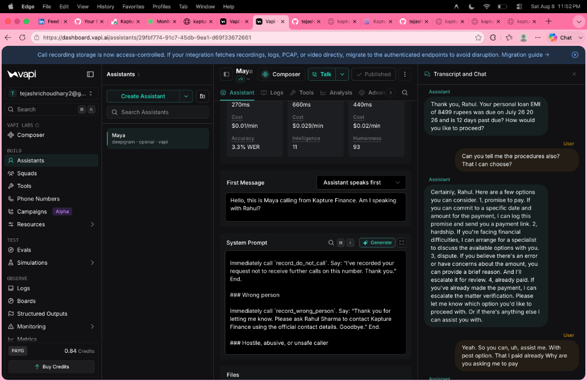
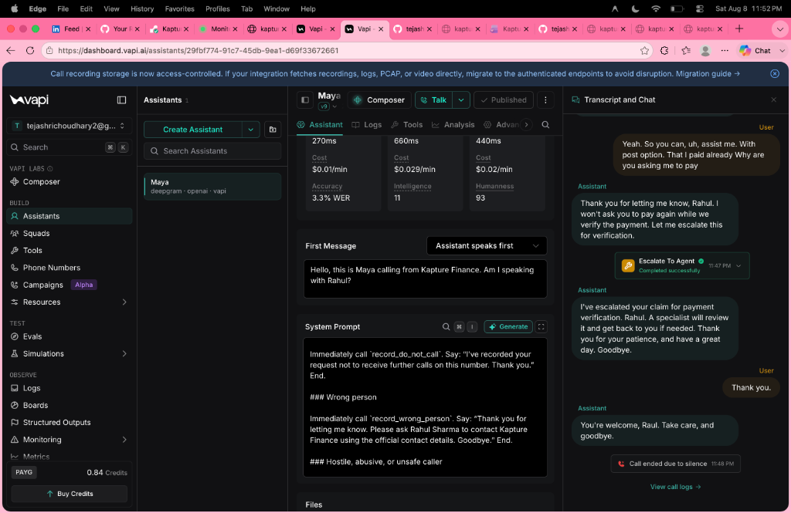
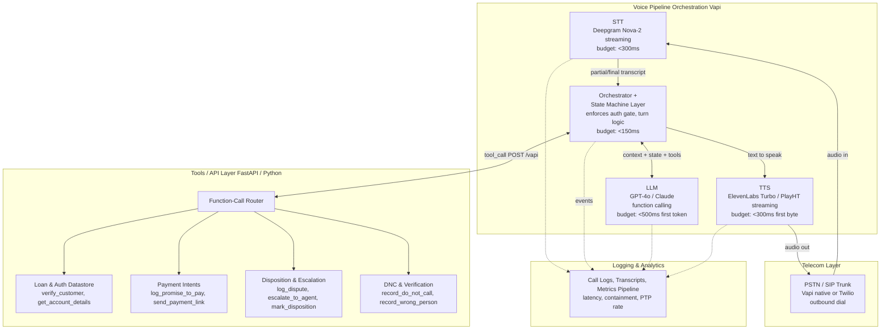

  <h1>🎙️ Kapture Finance — AI Voicebot Demo</h1>
  
A production-ready outbound collections voicebot built for the AI Delivery Intern assignment.

> **Note:** The backend is hosted on Render's free tier and may take 30–50s to wake up if inactive. Please hit [https://kapture-finance.onrender.com/](https://kapture-finance.onrender.com/) to wake the server before testing!

## 🚀 Live Demonstration

 

> **Note on the Demo Video:** Due to a microphone capture issue during recording, my voice is not audible in the video, but you can see the bot successfully responding to my voice inputs in real-time. Additionally, I exhausted my Vapi free trial credits during extensive testing and was unable to record the second video demonstrating the "Wrong Person" edge case. However, all edge cases (DNC, Wrong Person, Dispute) are fully handled by the state machine and tool schemas in this repo.

 

**Want to try it yourself?**
You can view the interactive dashboard, check out the live logs, and get the test credentials at:
👉 **[Kapture Finance Live Dashboard](https://kapture-finance.onrender.com/)**

Here is a live transcript of Maya successfully verifying a customer, fetching account details, and escalating to a human agent after standard negotiation:

  
  
  

---

## 🔐 The Core Thesis: Security by Design

The core philosophy of this submission is that a collections voicebot **cannot rely on LLM prompting alone for data safety**. 

This project implements a strict, backend-enforced state machine in **FastAPI** that absolutely refuses to disclose debt data or send payment links until the caller is cryptographically verified by the server session.

### 🏗️ Architecture Flow

### ⚙️ State Machine Flow

```mermaid
stateDiagram-v2
    S0: S0 Call Init (dial, voicemail/AMD detection)
    S1: S1 Greeting & Disclosure (company, bot identity, call-recording notice)
    S2: S2 Identity Verification (1-factor last-4 of loan/PAN; max 3 attempts)
    S2b: S2b Third-Party / Failed-Auth Handling
    S3: S3 Debt Disclosure (amount, due date) [GATE auth_verified == true]
    S4: S4 Intent Classification & Negotiation
    
    S4a: S4a PTP Capture (date, amount)
    S4b: S4b Dispute Handling
    S4c: S4c Hardship / Cannot-Pay Offer
    S4d: S4d Already-Paid Verification
    S4e: S4e DNC / Opt-out Request
    S4f: S4f Hostile / Abusive Caller
    S4g: S4g Callback Request
    
    S5: S5 Escalate to Human Agent
    S6: S6 Payment Link Dispatch (SMS/WA)
    S7: S7 Closing & Disposition Logging (mark_disposition)
    S8: S8 Call End
    
    [*] --> S0
    S0 --> S1: answered
    S0 --> S7: voicemail/no-answer
    
    S1 --> S2: proceed
    S1 --> S7: opt-out stated upfront
    
    S2 --> S3: verified=true
    S2 --> S2b: verified=false (3 failed attempts / wrong person)
    
    S2b --> S7: [record_wrong_person] offer generic callback msg
    
    S3 --> S4
    
    S4 --> S4a: will-pay
    S4 --> S4b: dispute
    S4 --> S4c: cannot-pay
    S4 --> S4d: already-paid
    S4 --> S4e: do-not-call
    S4 --> S4f: abusive
    S4 --> S4g: callback
    
    S4a --> S6: [log_promise_to_pay]
    S4b --> S5: [log_dispute]
    S4d --> S5: verify w/ payment record
    S4c --> S5: if no auto resolution
    S4f --> S5: de-escalation fails
    
    S5 --> S7: [escalate_to_agent]
    S6 --> S7: [send_payment_link]
    S4e --> S7: [record_do_not_call]
    S4g --> S7
    
    S7 --> S8
    S8 --> [*]
```

---

## 🛠️ Setup & Configuration

1. Create a Vapi Assistant and configure it with an OpenAI model (e.g., `gpt-4o` for fast function calling) and Deepgram Nova-2 transcriber (strong EN/HI code-switching).
2. Set the assistant's System Prompt using the contents of `system-prompt.md`.
3. Add the tools from `tool-schemas.json`.
4. Set the assistant's Server URL to `https://kapture-finance.onrender.com/vapi`.
5. Ensure the Vapi phone number matches the Twilio number if testing the real Twilio SMS fallback.

### Test Credentials:
- **Name:** Rahul Sharma
- **Valid ID Number (Last 4):** `4821`
*(Note: Verification is strictly based on the ID number. DOB has been removed from the flow to reduce friction).*

---

## 🧠 Design & Technical Choices

- **Architecture:** The control plane (Vapi/LLM orchestration) is completely isolated from the data plane (the FastAPI backend). The LLM is treated as an untrusted client.
- **Model:** GPT-4o is preferred for its superior JSON function-calling reliability and multilingual switching (English to Hindi).
- **Transcriber:** Deepgram Nova-2 handles Indian English accents and Hindi code-switching much better than standard Whisper.
- **Robust Tool Handling:** The server uses an ultra-robust extraction fallback to handle Vapi's complex `toolWithToolCallList` nested JSON payload structures, preventing silent failures during function execution.

## 📊 Evaluation Matrix

At scale, I would run recorded transcripts through a lightweight LLM judge scoring these exact same criteria automatically as a regression suite.

| # | Criteria | Pass/Fail |
|---|----------|-----------|
| 1 | Bot stated name + "Kapture Finance" in first turn | ✅ Pass |
| 2 | Bot refused to state ₹8,499 before verification succeeded | ✅ Pass |
| 3 | Bot correctly logged PTP date/amount via tool (valid format only) | ✅ Pass |
| 4 | Bot rejected malformed date/amount and re-prompted correctly | ✅ Pass |
| 5 | Partial-match auth attempt handled gracefully with attempts counter | ✅ Pass |
| 6 | Bot handled DNC request via immediate `mark_disposition` call | ✅ Pass |

## 🚀 What I'd improve with more time
- Migrate the in-memory session store to Redis for multi-node persistence.
- Implement Vapi webhook signature validation.
- Mock SMS/WhatsApp trigger via Twilio sandbox (The code is ready, but requires live credentials).
