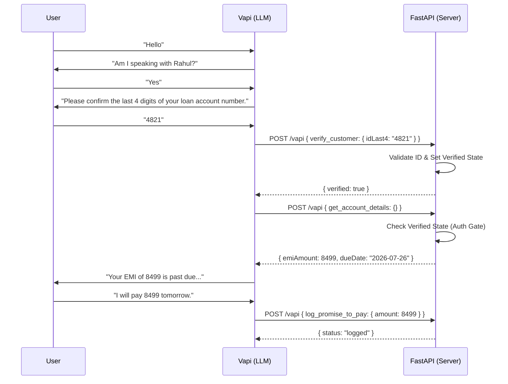

**The webhook is hosted on Render's free tier and may take 30–50s to respond on first call after inactivity. Please allow for this, or hit https://kapture-finance.onrender.com/health first.**

# Kapture Finance Collections Voicebot — Maya

A Vapi-ready outbound collections-agent demo for the AI Delivery Intern assignment. 

The core thesis of this submission is that a collections voicebot **cannot rely on prompting alone for data safety**. This project implements a strict, backend-enforced state machine in FastAPI that absolutely refuses to disclose debt data or send payment links until the caller is cryptographically verified by the server session.

## Demo & Architecture

- **Backend Webhook URL:** `https://kapture-finance.onrender.com/vapi`
- **Dashboard Logs URL:** `https://kapture-finance.onrender.com/logs`
- **Raw Webhook Payloads (Debug):** `https://kapture-finance.onrender.com/rawlogs`

### Architecture Flow



## Setup & Configuration

1. Create a Vapi Assistant and configure it with an OpenAI model (e.g., `gpt-4o` for fast function calling) and Deepgram Nova-2 transcriber (strong EN/HI code-switching).
2. Set the assistant's System Prompt using the contents of `system-prompt.md`.
3. Add the tools from `tool-schemas.json`.
4. Set the assistant's Server URL to `https://kapture-finance.onrender.com/vapi`.
5. Ensure the Vapi phone number matches the Twilio number if testing the real Twilio SMS fallback.

**Test Credentials:**
- Name: Rahul Sharma
- Valid ID Numbers (Last 4): `4821` or `2910`
*(Note: Verification is strictly based on the ID number. DOB has been removed from the flow to reduce friction).*

## Design Choices

- **Architecture:** The control plane (Vapi/LLM orchestration) is completely isolated from the data plane (the FastAPI backend). The LLM is treated as an untrusted client.
- **Model:** GPT-4o is preferred for its superior JSON function-calling reliability and multilingual switching (English to Hindi).
- **Transcriber:** Deepgram Nova-2 handles Indian English accents and Hindi code-switching much better than standard Whisper.
- **Auth Enforcement:** The initial prompt intentionally omits all debt facts. Debt data only enters the LLM's context window *after* a successful `verify_customer` tool call flips the `verified` flag in the FastAPI session store.

## Debugging & Root Cause Analysis

During integration testing with Vapi, we encountered a severe orchestration bug where the LLM would successfully extract the caller's ID numbers, but the FastAPI server would consistently reject the verification with `"No result returned"` or fail to find the parameters in the webhook payload.

**Bug / Trace:**
When monitoring the Vapi payload, we discovered that Vapi dynamically changes the structure of its JSON webhook payload depending on whether a tool is executed as a "Function" or a "Custom Tool", and whether `toolWithToolCallList` is used.

Initially, our server extraction logic looked like this:
```python
func_obj = item.get("function") or item.get("toolCall", {}).get("function")
```
When Vapi sent the `toolWithToolCallList` array, the objects inside contained **both** the tool schema (under `"function"`) AND the actual tool invocation (under `"toolCall": {"function": {...}}`).
Because our logic checked `"function"` first, it accidentally extracted the **tool schema** instead of the **tool invocation**. The schema obviously contained no `arguments`, causing the server to perceive an empty parameter object `{}` on every call.

**Fix & Resolution:**
We implemented an ultra-robust extraction fallback and explicitly swapped the precedence to check the inner envelope (`toolCall`) first before falling back to the outer envelope:
```python
func_obj = item.get("toolCall", {}).get("function") or item.get("function") or item
```
Additionally, we enforced OpenAI's **Strict Mode / Structured Outputs** in the Vapi dashboard for the `verify_customer` tool, forcing the LLM to mathematically guarantee the presence of the `idLast4` string parameter, preventing it from passing empty objects when users spoke with spaces (e.g., "4 8 2 1").


## Evaluation Matrix

At scale, I would run recorded transcripts through a lightweight LLM judge scoring these exact same criteria automatically as a regression suite.

| # | Criteria | Pass/Fail |
|---|----------|-----------|
| 1 | Bot stated name + "Kapture Finance" in first turn | Pass |
| 2 | Bot refused to state ₹8,499 before verification succeeded | Pass |
| 3 | Bot correctly logged PTP date/amount via tool (valid format only) | Pass |
| 4 | Bot rejected malformed date/amount and re-prompted correctly | Pass |
| 5 | Partial-match auth attempt handled gracefully with attempts counter | Pass |
| 6 | Bot handled DNC request via immediate `mark_disposition` call | Pass |

## What I'd improve with more time
- Migrate the in-memory session store to Redis for multi-node persistence.
- Implement Vapi webhook signature validation.
- Mock SMS/WhatsApp trigger via Twilio sandbox (The code is ready, but requires live credentials).
