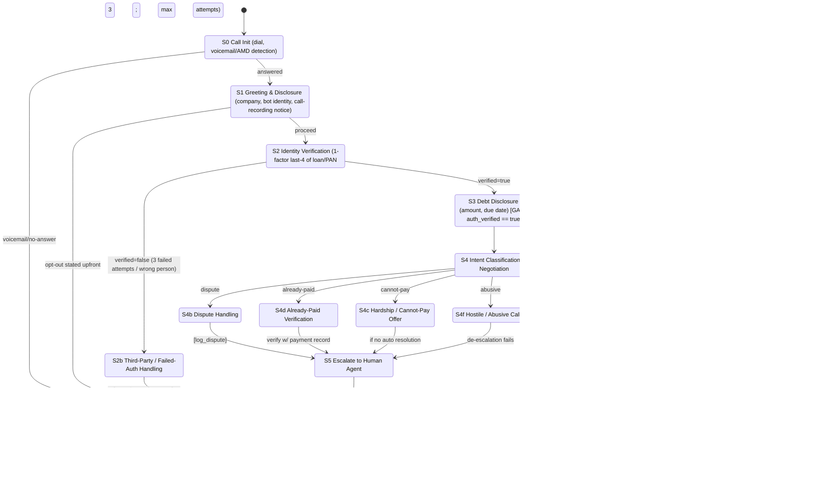

# State Machine Diagram

```mermaid
stateDiagram-v2
    S0: S0 Call Init (dial, voicemail/AMD detection)
    S1: S1 Greeting & Disclosure (company, bot identity, call-recording notice)
    S2: S2 Identity Verification (1-factor last-4 of loan/PAN; max 3 attempts)
    S2b: S2b Third-Party / Failed-Auth Handling
    S3: S3 Debt Disclosure (amount, due date) [GATE auth_verified == true]
    S4: S4 Intent Classification & Negotiation
    
    S4a: S4a PTP Capture (date, amount)
    S4b: S4b Dispute Handling
    S4c: S4c Hardship / Cannot-Pay Offer
    S4d: S4d Already-Paid Verification
    S4e: S4e DNC / Opt-out Request
    S4f: S4f Hostile / Abusive Caller
    S4g: S4g Callback Request
    
    S5: S5 Escalate to Human Agent
    S6: S6 Payment Link Dispatch (SMS/WA)
    S7: S7 Closing & Disposition Logging (mark_disposition)
    S8: S8 Call End
    
    [*] --> S0
    S0 --> S1: answered
    S0 --> S7: voicemail/no-answer
    
    S1 --> S2: proceed
    S1 --> S7: opt-out stated upfront
    
    S2 --> S3: verified=true
    S2 --> S2b: verified=false (3 failed attempts / wrong person)
    
    S2b --> S7: [record_wrong_person] offer generic callback msg
    
    S3 --> S4
    
    S4 --> S4a: will-pay
    S4 --> S4b: dispute
    S4 --> S4c: cannot-pay
    S4 --> S4d: already-paid
    S4 --> S4e: do-not-call
    S4 --> S4f: abusive
    S4 --> S4g: callback
    
    S4a --> S6: [log_promise_to_pay]
    S4b --> S5: [log_dispute]
    S4d --> S5: verify w/ payment record
    S4c --> S5: if no auto resolution
    S4f --> S5: de-escalation fails
    
    S5 --> S7: [escalate_to_agent]
    S6 --> S7: [send_payment_link]
    S4e --> S7: [record_do_not_call]
    S4g --> S7
    
    S7 --> S8
    S8 --> [*]
```
